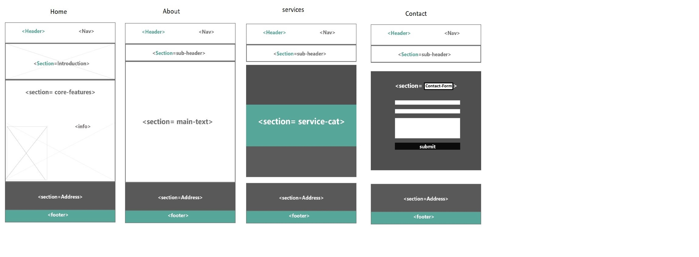

# Development Strategy

> App-Theme : Code Along

* In this project we will make a simple  website that is based on the example of App-Theme by Traversy Media.

* Here you can also see how the project is developed step by step as per Agile values,
dividing the project in sections of branches with working software frequently and visualizing the project from the users’ point of view.

* The project is build for the purpose of learning Incremental development with html & css files with Flex-boxGrid

## Wireframe

**A User can see my initial [repository](https://github.com/gelilaa/app-theme) and [live]( https://gelilaa.github.io/app-theme/.) demo**

### Repo Master Branch

- Generate from a Template
- Clone the repo
- Write initial, basic README
- Write `development-strategy.md` file
- Add a wireframe or a design of html layout
- Push the change
- Turn on GitHub Pages

# 1. User Story: Title

__As a site visitor,__ I want to know what the company is called 

### Branches

- This user story was developed on a branch called `1-title’`
- It was merged to `master` when the feature was finished.

### HTML
- Put up a title on head and other meta families
- Put up title content and navigation on header
- Put up a copyright to symbolize an official page of the company on footer and year of the web design 

### CSS

- Create a separate css file
- Add styling on new elements

## 2. User Story: introduction

___As a site visitor,__ I want to know what their business is and the standout point of this business

### Branches

- This user story was developed on a branch called `2-introduction’`
- It was merged to `master` when the feature was finished.

### HTML

- Some nice text in the section introducing users to this web page (Greeting words, such as Welcome)and a picture.

### CSS

Add styling on new elements 

## 3. User Story: core-features

__As a site visitor,__ I want to know what the core features of the company are 

### Branches

- This user story was developed on a branch called `3-core-features’`
- It was merged to `master` when the feature was finished.

### HTML
- Add a section: users can see what is included in the services of company as an option.
- Add a section to emphasize on the core-features.

### CSS

- Add styling for the new section element, 

## 4. User Story: Address

__As a site visitor,__
 I want to know where the company's address is.

I also want to know briefly about them and want to know  if there is a way to receive an update on their services  

### Branches

- This user story was developed on a branch called `4-Address`
- It was merged to `master` when the feature was finished.

### HTML

-  Add company section with a text and a form.

### CSS
- Add styling for the new section element and form

## 5. User Story: About

__As a site visitor,__ I want to know about the company’s story

### Branches

- This user story was developed on a branch called `5-about`
- It was merged to `master` when the feature was finished.
.

### HTML

- Create about.html template
- Put up title content
- Add sub-header section
- add company's address

### CSS
- Add styling on new elements

## 6. user story: About-Text

__As a site visitor,__ I want to know in detail, what they do and who they are 

### Branches

- This user story was developed on a branch called `6-about-text`
- It was merged to `master` when the feature was finished.
.

### HTML

- Add a section that tells the company's story in detail.

### CSS
- Add styling on new elements

## 7. user story: services
__As a site visitor,__ I want to know the services of the company,

### Branches

- This user story was developed on a branch called `7-services`
- It was merged to `master` when the feature was finished.

### HTML

- Create services.html template
- Put up title content
- Add sub-header section
- add company's address

### CSS
- Add styling on new elements

## 8 user story: services-catagory
__As a site visitor,__ I want to know the catagories of the services the company offers'

### Branches

-	This user story was developed on a branch called `8-services-cat`
-	It was merged to `master` when the feature was finished.

### HTML

- Create Service Package sections with a text. 

### CSS
- Add styling on new elements

## 9 user story: contact
__As a site visitor,__ I want to know how to contact the company,

### Branches

- This user story was developed on a branch called `9-contact`
- It was merged to `master` when the feature was finished.

### HTML

- Create contact.html template
- Put up title content
- Add sub-header section
- add company's address

### CSS
- Add styling on new elements

## 10. user story: contact form

__As a site visitor,__ I want to know how to contact the company,

### Branches

- This user story was developed on a branch called `10-contact-form`
- It was merged to `master` when the feature was finished.

### HTML

-Add section with contact form

### CSS
- Add styling on new elements

## Finishing Touches

- Write final, complete README:
  - [makeareadme.com](https://www.makeareadme.com/)
  - [bulldogjob](https://bulldogjob.com/news/449-how-to-write-a-good-readme-for-your-github-project)
  - [meakaakka](https://medium.com/@meakaakka/a-beginners-guide-to-writing-a-kickass-readme-7ac01da88ab3)
- Validate code to check for any last mistakes
